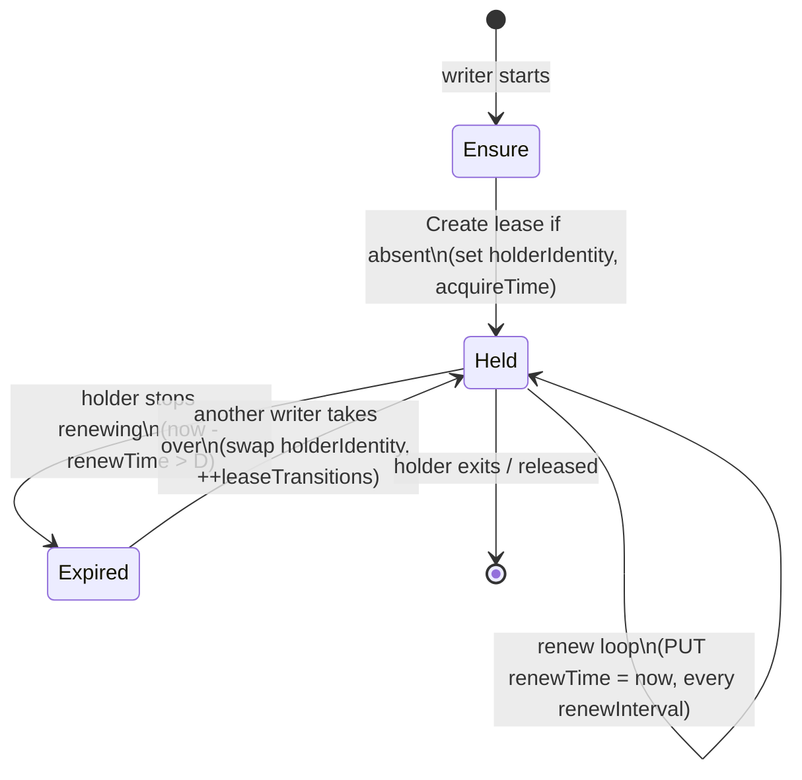

# Scenario 7: Leases — Node Heartbeats and Leader Election

Traces two independent but structurally parallel uses of the `coordination.k8s.io/v1 Lease` API:
1. **Node heartbeats** — kubelet periodically renews a `Lease` in `kube-node-lease` to signal liveness.
2. **Leader election** — control-plane components (kube-controller-manager, kube-scheduler) compete for a `Lease` in `kube-system` to ensure only one active instance runs at a time.

---

## Lease Concept Primer (Read This First)

Before tracing any code, build the right mental model. Both scenarios in this
document are just two specializations of **one** primitive, so understanding the
primitive once makes both flows obvious.

### What a Lease actually is

A `Lease` is **not** a lock with a mutex inside the API server. It is just a
small, regular API object that records a **timestamped claim**: "*holder X was
still alive at time T, and that claim is valid for D seconds.*" Nothing in the
API server actively expires it or calls anyone back. The whole mechanism is
**cooperative and clock-based**:

- The **holder** promises to re-stamp the object (`renewTime`) before it goes
  stale.
- **Observers** never trust a server-side flag; they independently compute
  `now - renewTime > leaseDurationSeconds` to decide "this lease looks dead."

This is why a Lease is cheap and scalable: it is a single object PUT on a timer,
not a distributed-locking subsystem. The "magic" lives entirely in *who writes*
and *who reads the clock*.

### The fields that carry all the meaning

Every behavior in this doc comes from these `LeaseSpec` fields
([staging/src/k8s.io/api/coordination/v1/types.go](../staging/src/k8s.io/api/coordination/v1/types.go#L53)):

| Field | Meaning in plain terms | Who writes it |
|-------|------------------------|---------------|
| `holderIdentity` | The name of the current claimant ("who holds it right now"). | Writer on acquire |
| `leaseDurationSeconds` | How long the claim stays valid **without** a refresh — the staleness threshold `D`. | Writer (config) |
| `renewTime` | Last time the holder re-stamped "I'm still alive." The heartbeat itself. | Holder, every interval |
| `acquireTime` | When the **current** holder first took the lease. | Writer on a transition |
| `leaseTransitions` | How many times the lease changed hands. Lets observers detect a takeover. | New holder on takeover |

> ⚠️ The two timing knobs are different on purpose: `leaseDurationSeconds` is the
> **validity window** (`D`), while the **renew interval** (`renewInterval`) is how
> often the holder refreshes. The system only stays healthy when
> `renewInterval < leaseDurationSeconds`, so several heartbeats can be missed
> before anyone is declared dead. (Node heartbeat default: renew every 10s, with
> `D = 40s` — i.e. 4 missed renews of slack.)

### The universal lifecycle (both flows are this state machine)



Read the loop as four conceptual phases. Every concrete function later in this
doc maps onto exactly one of them:

1. **Ensure** — make sure the object exists (`GET`, then `Create` on 404).
2. **Acquire** — write your own `holderIdentity`/`acquireTime` to claim it.
3. **Renew** — on a timer, `PUT` a fresh `renewTime` to keep the claim alive.
4. **Expire / take over** — an observer notices the claim is stale and, *if it
   cares*, overwrites the holder.

### How the one concept splits into the two scenarios

The two flows differ only in **who reads the lease and what they do about
expiry** — the write side is nearly identical:

| Concept phase | Node Heartbeat (Flow A) | Leader Election (Flow B) |
|---------------|-------------------------|--------------------------|
| Who renews | Each kubelet renews **its own** lease | Whichever replica is currently the leader |
| Who observes expiry | `node-lifecycle-controller` in kube-controller-manager | The **standby** replicas, polling the same lease |
| Reaction to expiry | Mark the Node `NotReady` (no takeover — a node can't be "taken over") | A standby **acquires** the lease and starts doing work |
| Contention | None — one writer per lease | Many writers racing for one lease; `leaseTransitions` records handoffs |

So: **Flow A is a lease with one writer and an external watcher; Flow B is a
lease many writers compete to hold.** Keep that one-line distinction in mind and
the rest of the trace is just plumbing(단순 연결).

---

## Big Picture

Both flows use the same `coordination.k8s.io/v1` `Lease` object and the same API server PUT/GET path, but with different semantics:

| Aspect | Node Heartbeat | Leader Election |
|--------|---------------|-----------------|
| Lease namespace | `kube-node-lease` | `kube-system` |
| Lease name | `<node-name>` | e.g. `kube-controller-manager` |
| `holderIdentity` | node name | `hostname_uuid` |
| Frequency | every ~10s (25% of 40s default lease duration) | every ~2s (`RetryPeriod`) |
| On failure | node goes `NotReady` after `leaseDuration` | standby takes over after `LeaseDuration` (15s default) |
| Code entry | `pkg/kubelet/kubelet.go` → `nodeLeaseController.Run()` | `cmd/kube-controller-manager/app/controllermanager.go` → `leaderElectAndRun()` |

```
Flow A: Node Heartbeat
  kubelet.Run()
    └─ go kl.nodeLeaseController.Run()
          └─ wait.JitterUntil → controller.sync()
                └─ retryUpdateLease()  OR  backoffEnsureLease() + retryUpdateLease()
                      └─ leaseClient.Update(Lease{renewTime: now})
                            └─ HTTPS PUT /apis/coordination.k8s.io/v1/namespaces/kube-node-lease/leases/<node>
                                  └─ etcd PUT

Flow B: Leader Election
  controllermanager.Run()
    └─ leaderElectAndRun()
          └─ leaderelection.RunOrDie()
                └─ LeaderElector.Run()
                      ├─ acquire() → wait until tryAcquireOrRenew() succeeds
                      │     └─ LeaseLock.Update() / Create()
                      │           └─ HTTPS PUT /apis/coordination.k8s.io/v1/namespaces/kube-system/leases/...
                      └─ OnStartedLeading(ctx) → run() [start all controllers]
                         renew() → loop of tryAcquireOrRenew()
```

---

## Reading Guide (Beginner)

- **Trigger:** kubelet starts a background renew loop for node leases, while control-plane binaries start a leader-election loop during process startup.
- **Shared object, different meaning:** both flows write the same `Lease` API kind, but node heartbeats report liveness and leader election enforces single-writer control-plane behavior.
- **First durable state change:** the first successful `Lease` create or update in the API server.
- **Success criterion for this scenario:** a node lease keeps `renewTime` fresh, or one control-plane replica continuously renews the leader-election lease.
- **Most common confusion:** renewing a `Lease` does not itself perform work; it only grants the right for other loops to keep acting.

## Interface Resolution Guide (This Scenario)

This scenario crosses a small but important constructor-hides-struct boundary. Use this order:
1. Find the interface field or function parameter (`lease.Controller`, `resourcelock.Interface`).
2. Look for a compile-time assertion if it exists.
3. If no assertion exists, follow the constructor return type and its final `return &struct{...}` line.
4. Confirm the assignment or callback registration that stores the interface value.
5. Confirm the runtime call site (`Run`, `Get`, `Create`, `Update`).

### Worked Example: `lease.Controller` -> `*controller`

The kubelet's node-heartbeat path uses this exact interface-to-concrete hop:

1. Interface: `type Controller interface` in [../staging/src/k8s.io/component-helpers/apimachinery/lease/controller.go](../staging/src/k8s.io/component-helpers/apimachinery/lease/controller.go#L50).
2. Concrete struct: `controller` in [../staging/src/k8s.io/component-helpers/apimachinery/lease/controller.go](../staging/src/k8s.io/component-helpers/apimachinery/lease/controller.go#L59).
3. Factory that hides the type: `NewController(...) Controller` in [../staging/src/k8s.io/component-helpers/apimachinery/lease/controller.go](../staging/src/k8s.io/component-helpers/apimachinery/lease/controller.go#L83) returns `&controller{...}`.
4. Assignment wiring: kubelet stores that interface value in `klet.nodeLeaseController = lease.NewController(...)` in [../pkg/kubelet/kubelet.go](../pkg/kubelet/kubelet.go#L1148).
5. Runtime call site: `go kl.nodeLeaseController.Run(...)` in [../pkg/kubelet/kubelet.go](../pkg/kubelet/kubelet.go#L1951) invokes the concrete `controller.Run` loop.

This is a pure wiring example: there is no `var _ lease.Controller = &controller{}` line, so the constructor return type and field assignment are the proof.

---

## Entry Point

### Flow A: Node Heartbeat — kubelet

**File:** [cmd/kubelet/kubelet.go](../cmd/kubelet/kubelet.go#L35)

```go
// Lines 35-39: main()
func main() {
    command := app.NewKubeletCommand()
    os.Exit(cli.Run(command))
}
```

The kubelet's `NewKubelet()` constructor wires up the lease controller, and `Kubelet.Run()` starts it.

### Flow B: Leader Election — kube-controller-manager

**File:** [cmd/kube-controller-manager/app/controllermanager.go](../cmd/kube-controller-manager/app/controllermanager.go#L199)

```go
// Line 199: Run()
func Run(ctx context.Context, c *config.CompletedConfig) error { ... }
```

The scheduler entry is structurally identical; see [cmd/kube-scheduler/app/server.go](../cmd/kube-scheduler/app/server.go#L305).

---

## End-to-End Flow

### Flow A: Node Heartbeat

```
NewKubelet()  [pkg/kubelet/kubelet.go:1148]
  │
  └─ klet.nodeLeaseController = lease.NewController(
         holderIdentity = nodeName,
         leaseName      = nodeName,
         leaseNamespace = "kube-node-lease",
         renewInterval  = leaseDuration * 0.25,  // default: 40s * 0.25 = 10s
         postProcessFunc = SetNodeOwnerFunc(...)  // sets OwnerRef → Node
     )
  │
Kubelet.Run()  [pkg/kubelet/kubelet.go:1951]
  │
  └─ go kl.nodeLeaseController.Run(context.Background())
        │
        └─ wait.JitterUntilWithContext(ctx, c.sync, renewInterval, 0.04, ...)
              │  [every ~10s with 4% jitter](10초의 4%에 해당하는 약 0.4초의 미세한 무작위 변동 폭을 추가하는 것입니다.선더링 허드(Thundering Herd)' 현상을 방지)
              │
              └─ controller.sync()
                    │
                    ├─ [fast path] c.latestLease != nil
                    │    └─ retryUpdateLease(latestLease)
                    │         └─ leaseClient.Update(newLease{renewTime: now})
                    │               → PUT kube-node-lease/<node-name>
                    │
                    └─ [slow path / first run] backoffEnsureLease()
                         ├─ ensureLease(): GET + Create if 404
                         └─ retryUpdateLease(lease): Update renewTime
```

### Flow B: Leader Election

```
controllermanager.Run()  [controllermanager.go:199]
  │
  ├─ id = hostname + "_" + uuid  [line 311]
  │
  └─ leaderElectAndRun(ctx, c, id, ...)  [line 397]
        │
        ├─ resourcelock.NewFromKubeconfig("leases", "kube-system", "kube-controller-manager", ...)
        │    └─ returns *LeaseLock{Client: coordinationV1Client}
        │
        └─ leaderelection.RunOrDie(ctx, LeaderElectionConfig{
               Lock:          *LeaseLock,
               LeaseDuration: 15s,
               RenewDeadline: 10s,
               RetryPeriod:   2s,
               Callbacks: {
                 OnStartedLeading: startedLeading(run)  // start all controllers
                 OnStoppedLeading: os.Exit(1)
               },
           })
              │
              └─ LeaderElector.Run(ctx)
                    │
                    ├─ acquire(ctx) — loop until winner
                    │    └─ JitterUntil(RetryPeriod):
                    │         tryAcquireOrRenew() → true on first successful Create/Update
                    │         → cancel() [unblocks acquire]
                    │
                    ├─ go OnStartedLeading(ctx)  // non-blocking start of controllers
                    │
                    └─ renew(ctx) — loop while leader
                         └─ PollUntilContextTimeout(RetryPeriod, RenewDeadline):
                              tryAcquireOrRenew() → false → cancel → OnStoppedLeading
```

---

## Step-by-Step Code Trace

### [A1] Lease Controller Construction

**File:** [pkg/kubelet/kubelet.go](../pkg/kubelet/kubelet.go#L1146)

```go
// Lines 1146-1158
leaseDuration  := time.Duration(kubeCfg.NodeLeaseDurationSeconds) * time.Second  // default 40s
renewInterval  := time.Duration(float64(leaseDuration) * nodeLeaseRenewIntervalFraction)
// nodeLeaseRenewIntervalFraction = 0.25  → renewInterval = 10s

klet.nodeLeaseController = lease.NewController(
    klet.clock,
    klet.heartbeatClient,        // separate client from the main kubelet client
    string(klet.nodeName),       // holderIdentity = "node-1"
    kubeCfg.NodeLeaseDurationSeconds,
    klet.onRepeatedHeartbeatFailure,   // callback on consecutive failures
    renewInterval,
    string(klet.nodeName),       // leaseName = "node-1"
    v1.NamespaceNodeLease,       // "kube-node-lease"
    util.SetNodeOwnerFunc(ctx, klet.heartbeatClient, string(klet.nodeName)),
)
```

**Why a separate `heartbeatClient`?** Lease renewal needs to succeed even when the cluster is stressed. Using a dedicated client with its own connection pool and rate limit prevents heartbeats from being queued behind large workloads going through the primary client.

> ⚠️ **`nodeLeaseController` is the `lease.Controller` interface — concrete type is `*controller`.** Interface defined at [controller.go:51](../staging/src/k8s.io/component-helpers/apimachinery/lease/controller.go#L51). Concrete struct is `controller` at [controller.go:59](../staging/src/k8s.io/component-helpers/apimachinery/lease/controller.go#L59). `NewController()` ([controller.go:81](../staging/src/k8s.io/component-helpers/apimachinery/lease/controller.go#L81)) returns `Controller` (the interface), hiding the struct. There is no `var _ Controller = &controller{}` assertion in this file — the binding is proven by `NewController(...)` having return type `Controller` and returning `&controller{...}` on the last line of the constructor.

---

### [A2] Starting the Heartbeat Loop

**File:** [pkg/kubelet/kubelet.go](../pkg/kubelet/kubelet.go#L1948)

```go
// Lines 1948-1952
// Keep renewing the node lease until the kubelet exits.
// This intentionally does not use the kubelet context so lease renewal can
// continue during graceful shutdown.
go kl.nodeLeaseController.Run(context.Background())
```

Note that `context.Background()` (not the kubelet's cancellable context) is used here intentionally — lease renewals must survive `kubectl drain` and graceful termination.

---

### [A3] `controller.Run()` and the Sync Loop

**File:** [staging/src/k8s.io/component-helpers/apimachinery/lease/controller.go](../staging/src/k8s.io/component-helpers/apimachinery/lease/controller.go#L141)

```go
// Lines 141-146
func (c *controller) Run(ctx context.Context) {
    if c.leaseClient == nil {
        return  // no-op if lease feature is disabled
    }
    wait.JitterUntilWithContext(ctx, c.sync, c.renewInterval, 0.04, true)
    // Runs c.sync() every renewInterval ± 4% jitter, immediately on first call (true)
}
```

---

### [A4] `controller.sync()` — Optimistic Fast Path

**File:** [staging/src/k8s.io/component-helpers/apimachinery/lease/controller.go](../staging/src/k8s.io/component-helpers/apimachinery/lease/controller.go#L151)

```go
// Lines 151-182
func (c *controller) sync(ctx context.Context) {
    if c.stopCalled.Load() { return }
    c.reconcilingLock.Lock()
    defer c.reconcilingLock.Unlock()

    if c.latestLease != nil {
        // Fast path: optimistically update without a GET first.
        // Avoids one round-trip to the API server per heartbeat.
        err := c.retryUpdateLease(ctx, c.latestLease)
        if err == nil { return }
        // On conflict (someone else modified the lease), fall through to slow path.
        klog.FromContext(ctx).Info("failed to update lease using latest lease, fallback to ensure lease", ...)
    }

    // Slow path: GET or CREATE, then update.
    lease, created := c.backoffEnsureLease(ctx)
    c.latestLease = lease
    if !created && lease != nil {
        c.retryUpdateLease(ctx, lease)
    }
}
```

The key insight: the controller caches `latestLease` from the previous successful write. On the next tick it sends a direct UPDATE (no GET) using the cached `resourceVersion`, relying on optimistic locking. Only if the API server returns a conflict (resourceVersion mismatch) does it fall back to a GET.

---

### [A5] `retryUpdateLease()` — Building and Sending the Lease Object

**File:** [staging/src/k8s.io/component-helpers/apimachinery/lease/controller.go](../staging/src/k8s.io/component-helpers/apimachinery/lease/controller.go#L237)

```go
// Lines 237-265
func (c *controller) retryUpdateLease(ctx context.Context, base *coordinationv1.Lease) error {
    for i := 0; i < maxUpdateRetries; i++ {  // maxUpdateRetries = 5
        leaseToUpdate, err := c.newLease(base)
        // newLease sets:
        //   Spec.HolderIdentity = &nodeName
        //   Spec.LeaseDurationSeconds = &leaseDurationSeconds
        //   Spec.RenewTime = &now         ← the heartbeat timestamp
        // and calls newLeasePostProcessFunc (sets OwnerReference to Node)

        lease, err := c.leaseClient.Update(ctx, leaseToUpdate, metav1.UpdateOptions{})
        if err == nil {
            c.latestLease = lease
            return nil
        }
        if apierrors.IsConflict(err) {
            base, _ = c.backoffEnsureLease(ctx)  // re-fetch on conflict
            continue
        }
        if i > 0 && c.onRepeatedHeartbeatFailure != nil {
            c.onRepeatedHeartbeatFailure()  // tell kubelet about the problem
        }
    }
    return fmt.Errorf("failed %d attempts to update lease", maxUpdateRetries)
}
```

**The Lease object on the wire:**

```yaml
apiVersion: coordination.k8s.io/v1
kind: Lease
metadata:
  name: node-1
  namespace: kube-node-lease
  ownerReferences:
  - apiVersion: v1
    kind: Node
    name: node-1
    uid: <node-uid>
spec:
  holderIdentity: node-1
  leaseDurationSeconds: 40
  renewTime: "2026-06-14T12:34:56.000000Z"  # updated every ~10s
```

---

### [B1] Leader Election Wiring in kube-controller-manager

**File:** [cmd/kube-controller-manager/app/controllermanager.go](../cmd/kube-controller-manager/app/controllermanager.go#L838)

```go
// Lines 838-877: leaderElectAndRun()
func leaderElectAndRun(ctx, c, lockIdentity, electionChecker, resourceLock, leaseName string,
    callbacks leaderelection.LeaderCallbacks) {

    // 1. Create the resource lock (a LeaseLock backed by coordination.k8s.io/v1)
    rl, err := resourcelock.NewFromKubeconfig(
        resourceLock,       // "leases"
        c.ComponentConfig.Generic.LeaderElection.ResourceNamespace,  // "kube-system"
        leaseName,          // "kube-controller-manager"
        resourcelock.ResourceLockConfig{
            Identity:      lockIdentity,   // "hostname_uuid"
            EventRecorder: c.EventRecorder,
        },
        c.Kubeconfig,
        c.ComponentConfig.Generic.LeaderElection.RenewDeadline.Duration)

    // 2. Block until elected or context canceled
    leaderelection.RunOrDie(ctx, leaderelection.LeaderElectionConfig{
        Lock:            rl,                // *LeaseLock
        LeaseDuration:   15s,
        RenewDeadline:   10s,
        RetryPeriod:     2s,
        Callbacks:       callbacks,
        WatchDog:        electionChecker,
        ReleaseOnCancel: utilfeature.DefaultFeatureGate.Enabled(cmfeatures.ControllerManagerReleaseLeaderElectionLockOnExit),
        Coordinated:     utilfeature.DefaultFeatureGate.Enabled(kubefeatures.CoordinatedLeaderElection),
    })
}
```

> ⚠️ **`rl` is typed as `resourcelock.Interface` — the concrete type is `*LeaseLock`.**
> 1. **Interface:** `type Interface interface` — [resourcelock/interface.go:84](../staging/src/k8s.io/client-go/tools/leaderelection/resourcelock/interface.go#L84) — defines `Get`, `Create`, `Update`, `RecordEvent`, `Identity`, `Describe`.
> 2. **Concrete struct:** `LeaseLock` — [resourcelock/leaselock.go:30](../staging/src/k8s.io/client-go/tools/leaderelection/resourcelock/leaselock.go#L30).
> 3. **Factory:** `resourcelock.new(lockType="leases", ...)` in [resourcelock/interface.go:105](../staging/src/k8s.io/client-go/tools/leaderelection/resourcelock/interface.go#L105) returns `leaseLock` when `lockType == LeasesResourceLock`.
> 4. **No compile-time `var _ Interface = &LeaseLock{}`** exists in this package; the binding is confirmed by the factory `switch` returning `leaseLock` (a `*LeaseLock`) for the `"leases"` case.
> 5. At runtime `rl` is always `*LeaseLock`; old `endpoints`/`configmaps` lock types return an error.

---

### [B2] `LeaderElector.Run()` — The State Machine

**File:** [staging/src/k8s.io/client-go/tools/leaderelection/leaderelection.go](../staging/src/k8s.io/client-go/tools/leaderelection/leaderelection.go#L213)

```go
// Lines 213-225: Run()
func (le *LeaderElector) Run(ctx context.Context) {
    defer runtime.HandleCrashWithContext(ctx)
    defer le.config.Callbacks.OnStoppedLeading()   // always called on exit

    if !le.acquire(ctx) {
        return  // context canceled before we ever became leader
    }
    ctx, cancel := context.WithCancel(ctx)
    defer cancel()
    go le.config.Callbacks.OnStartedLeading(ctx)   // start controllers in a goroutine
    le.renew(ctx)                                  // stay leader; blocks until loss
}
```

---

### [B3] `acquire()` — Competing for the Lease

**File:** [staging/src/k8s.io/client-go/tools/leaderelection/leaderelection.go](../staging/src/k8s.io/client-go/tools/leaderelection/leaderelection.go#L253)

```go
// Lines 253-273: acquire()
func (le *LeaderElector) acquire(ctx context.Context) bool {
    succeeded := false
    wait.JitterUntilWithContext(ctx, func(ctx context.Context) {
        succeeded = le.tryAcquireOrRenew(ctx)
        le.maybeReportTransition()  // fire OnNewLeader if holder changed
        if !succeeded { return }
        le.config.Lock.RecordEvent("became leader")
        le.metrics.leaderOn(le.config.Name)
        cancel()  // unblock the acquire loop
    }, le.config.RetryPeriod, JitterFactor, true)
    return succeeded
}
```

Candidates poll every `RetryPeriod` (2s). The first to successfully `Create` or `Update` the Lease wins. All others see a valid, unexpired lease and skip.

---

### [B4] `tryAcquireOrRenew()` — The Core Election Logic

**File:** [staging/src/k8s.io/client-go/tools/leaderelection/leaderelection.go](../staging/src/k8s.io/client-go/tools/leaderelection/leaderelection.go#L443)

```go
// Lines 443-512: tryAcquireOrRenew()
func (le *LeaderElector) tryAcquireOrRenew(ctx context.Context) bool {
    now := metav1.NewTime(le.clock.Now())
    leaderElectionRecord := rl.LeaderElectionRecord{
        HolderIdentity:       le.config.Lock.Identity(),   // "hostname_uuid"
        LeaseDurationSeconds: int(le.config.LeaseDuration / time.Second),  // 15
        RenewTime:            now,
        AcquireTime:          now,
    }

    // 1. Fast path (leader already): update without GET
    if le.IsLeader() && le.isLeaseValid(now.Time) {
        leaderElectionRecord.AcquireTime = le.getObservedRecord().AcquireTime
        leaderElectionRecord.LeaderTransitions = le.getObservedRecord().LeaderTransitions
        err := le.config.Lock.Update(ctx, leaderElectionRecord)
        if err == nil {
            le.setObservedRecord(&leaderElectionRecord)
            return true
        }
        // fall through to slow path on conflict
    }

    // 2. Slow path: GET current record
    oldRecord, rawRecord, err := le.config.Lock.Get(ctx)
    if apierrors.IsNotFound(err) {
        // No lease yet: Create and become leader
        le.config.Lock.Create(ctx, leaderElectionRecord)
        le.setObservedRecord(&leaderElectionRecord)
        return true
    }

    // 3. Update observed record if it changed
    if !bytes.Equal(le.observedRawRecord, rawRecord) {
        le.setObservedRecord(oldRecord)
        le.observedRawRecord = rawRecord
    }

    // 4. Someone else holds a valid lease → back off
    if len(oldRecord.HolderIdentity) > 0 && le.isLeaseValid(now.Time) && !le.IsLeader() {
        return false
    }

    // 5. Lease expired or we are already leader → Update
    if le.IsLeader() {
        leaderElectionRecord.AcquireTime = oldRecord.AcquireTime      // preserve acquire time
        leaderElectionRecord.LeaderTransitions = oldRecord.LeaderTransitions
    } else {
        leaderElectionRecord.LeaderTransitions = oldRecord.LeaderTransitions + 1
    }
    le.config.Lock.Update(ctx, leaderElectionRecord)
    le.setObservedRecord(&leaderElectionRecord)
    return true
}
```

**`isLeaseValid(now)`:**
```go
// Lease is still valid if observedTime + LeaseDuration > now
le.observedTime.Add(time.Second * time.Duration(observedRecord.LeaseDurationSeconds)).After(now)
```

---

### [B5] `LeaseLock.Update()` — The Actual API Call

**File:** [staging/src/k8s.io/client-go/tools/leaderelection/resourcelock/leaselock.go](../staging/src/k8s.io/client-go/tools/leaderelection/resourcelock/leaselock.go#L73)

```go
// Lines 73-92: Update()
func (ll *LeaseLock) Update(ctx context.Context, ler LeaderElectionRecord) error {
    ll.lease.Spec = LeaderElectionRecordToLeaseSpec(&ler)
    // maps: HolderIdentity → holderIdentity, LeaseDuration → leaseDurationSeconds,
    //       AcquireTime, RenewTime, LeaderTransitions → leaseTransitions

    lease, err := ll.Client.Leases(ll.LeaseMeta.Namespace).Update(ctx, ll.lease, metav1.UpdateOptions{})
    // PUT /apis/coordination.k8s.io/v1/namespaces/kube-system/leases/kube-controller-manager
    if err != nil { return err }
    ll.lease = lease  // cache the returned object (with new resourceVersion)
    return nil
}
```

**The Lease object on the wire:**

```yaml
apiVersion: coordination.k8s.io/v1
kind: Lease
metadata:
  name: kube-controller-manager
  namespace: kube-system
spec:
  holderIdentity: node-1_a1b2c3d4-...   # hostname + UUID
  leaseDurationSeconds: 15
  acquireTime: "2026-06-14T10:00:00.000000Z"  # set when leader acquired
  renewTime: "2026-06-14T12:34:56.000000Z"    # updated every ~2s
  leaseTransitions: 3                          # incremented on each new leader
```

---

### [B6] `renew()` — Staying Leader

**File:** [staging/src/k8s.io/client-go/tools/leaderelection/leaderelection.go](../staging/src/k8s.io/client-go/tools/leaderelection/leaderelection.go#L276)

```go
// Lines 276-305: renew()
func (le *LeaderElector) renew(ctx context.Context) {
    defer le.config.Lock.RecordEvent("stopped leading")
    ctx, cancel := context.WithCancel(ctx)
    defer cancel()
    wait.UntilWithContext(ctx, func(ctx context.Context) {
        err := wait.PollUntilContextTimeout(ctx,
            le.config.RetryPeriod, le.config.RenewDeadline, true,
            func(ctx context.Context) (bool, error) {
                return le.tryAcquireOrRenew(ctx), nil
            })
        le.maybeReportTransition()
        if err == nil {
            logger.V(5).Info("Successfully renewed lease")
            return
        }
        // RenewDeadline passed without a successful renew → give up leadership
        le.metrics.leaderOff(le.config.Name)
        logger.Info("Failed to renew lease, stopping")
        cancel()  // causes OnStoppedLeading to be called
    }, le.config.RetryPeriod)

    if le.config.ReleaseOnCancel {
        le.release(logger)  // zero out holderIdentity to signal voluntary exit
    }
}
```

---

## Related Code Map

| Component | File | Key Symbol | Line |
|-----------|------|------------|------|
| `Lease` API type | [staging/src/k8s.io/api/coordination/v1/types.go](../staging/src/k8s.io/api/coordination/v1/types.go#L40) | `type Lease struct` | 40 |
| `LeaseSpec` | [staging/src/k8s.io/api/coordination/v1/types.go](../staging/src/k8s.io/api/coordination/v1/types.go#L54) | `type LeaseSpec struct` | 54 |
| Lease controller interface | [staging/src/k8s.io/component-helpers/apimachinery/lease/controller.go](../staging/src/k8s.io/component-helpers/apimachinery/lease/controller.go#L51) | `type Controller interface` | 51 |
| Lease controller struct | [staging/src/k8s.io/component-helpers/apimachinery/lease/controller.go](../staging/src/k8s.io/component-helpers/apimachinery/lease/controller.go#L59) | `type controller struct` | 59 |
| Lease controller constructor | [staging/src/k8s.io/component-helpers/apimachinery/lease/controller.go](../staging/src/k8s.io/component-helpers/apimachinery/lease/controller.go#L81) | `NewController()` | 81 |
| Kubelet wiring | [pkg/kubelet/kubelet.go](../pkg/kubelet/kubelet.go#L1148) | `klet.nodeLeaseController = lease.NewController(...)` | 1148 |
| Heartbeat loop start | [pkg/kubelet/kubelet.go](../pkg/kubelet/kubelet.go#L1951) | `go kl.nodeLeaseController.Run(context.Background())` | 1951 |
| OwnerRef post-process hook | [pkg/kubelet/util/nodelease.go](../pkg/kubelet/util/nodelease.go#L31) | `SetNodeOwnerFunc()` | 31 |
| `resourcelock.Interface` | [staging/src/k8s.io/client-go/tools/leaderelection/resourcelock/interface.go](../staging/src/k8s.io/client-go/tools/leaderelection/resourcelock/interface.go#L84) | `type Interface interface` | 84 |
| `LeaseLock` struct | [staging/src/k8s.io/client-go/tools/leaderelection/resourcelock/leaselock.go](../staging/src/k8s.io/client-go/tools/leaderelection/resourcelock/leaselock.go#L30) | `type LeaseLock struct` | 30 |
| `LeaderElector` struct | [staging/src/k8s.io/client-go/tools/leaderelection/leaderelection.go](../staging/src/k8s.io/client-go/tools/leaderelection/leaderelection.go#L189) | `type LeaderElector struct` | 189 |
| `LeaderElector.Run()` | [staging/src/k8s.io/client-go/tools/leaderelection/leaderelection.go](../staging/src/k8s.io/client-go/tools/leaderelection/leaderelection.go#L213) | `Run()` | 213 |
| `tryAcquireOrRenew()` | [staging/src/k8s.io/client-go/tools/leaderelection/leaderelection.go](../staging/src/k8s.io/client-go/tools/leaderelection/leaderelection.go#L443) | `tryAcquireOrRenew()` | 443 |
| KCM `leaderElectAndRun` | [cmd/kube-controller-manager/app/controllermanager.go](../cmd/kube-controller-manager/app/controllermanager.go#L838) | `leaderElectAndRun()` | 838 |
| KCM `leaderElectAndRun` call site | [cmd/kube-controller-manager/app/controllermanager.go](../cmd/kube-controller-manager/app/controllermanager.go#L397) | `leaderElectAndRun(...)` | 397 |
| Scheduler LE callback wiring | [cmd/kube-scheduler/app/server.go](../cmd/kube-scheduler/app/server.go#L309) | `cc.LeaderElection.Callbacks = ...` | 309 |
| Scheduler `leaderElector.Run()` | [cmd/kube-scheduler/app/server.go](../cmd/kube-scheduler/app/server.go#L338) | `leaderElector.Run(ctx)` | 338 |

---

## Verify It Yourself

### Node Heartbeat

```bash
# Watch a node's lease object update in real time
kubectl get lease -n kube-node-lease <node-name> -w

# Inspect the current lease state
kubectl get lease -n kube-node-lease <node-name> -o yaml
# Look for: spec.renewTime  (should be within the last leaseDurationSeconds)

# Find the lease duration configured on the kubelet
kubectl get node <node-name> -o jsonpath='{.status.conditions[?(@.type=="Ready")]}'

# Simulate a kubelet crash: watch the node go NotReady after leaseDurationSeconds
# Stop kubelet: systemctl stop kubelet
# After ~40s: kubectl get node <node-name>  → STATUS NotReady

# See how the node controller uses the lease to detect NotReady
kubectl describe node <node-name> | grep -A5 "Conditions:"
```

### Leader Election

```bash
# Show which instance holds the leader lease right now
kubectl get lease -n kube-system kube-controller-manager -o yaml
# Look for: spec.holderIdentity (hostname_uuid), spec.renewTime

kubectl get lease -n kube-system kube-scheduler -o yaml

# Watch a leadership transition (e.g. after deleting the leader pod)
kubectl get lease -n kube-system kube-controller-manager -w

# See leader election events
kubectl get events -n kube-system \
  --field-selector reason=LeaderElection,involvedObject.name=kube-controller-manager

# Check the health of the leader election via the /healthz endpoint
# (electionChecker.Check() fails if lease is > 20s stale)
kubectl get --raw /healthz?verbose | grep leaderElection
```

---

## Gotchas

> ⚠️ **Node heartbeat uses `context.Background()`, not the kubelet's context.** This is intentional ([kubelet.go:1949](../pkg/kubelet/kubelet.go#L1949)). During graceful shutdown the kubelet's context is cancelled but lease renewal continues so other components don't prematurely declare the node dead while pods are still being drained.

> ⚠️ **`leaseDurationSeconds` in the Node Lease spec is not a TTL enforced by etcd.** The lease object has no etcd TTL. The node lifecycle controller (`pkg/controller/nodelifecycle/`) watches lease `renewTime` and transitions the node to `NotReady` if `now - renewTime > leaseDurationSeconds`. Nothing deletes the stale object automatically.

> ⚠️ **Leader election does not guarantee mutual exclusion (no fencing).** The period between losing the lease and `OnStoppedLeading` being called is a window where two processes could both be acting as leader. `ReleaseOnCancel=true` mitigates this for graceful shutdowns but not for crashes. Controllers must be designed to tolerate brief dual-leader windows.

> ⚠️ **The `identity` is `hostname + "_" + uuid`.** The UUID suffix prevents two processes on the same host (common in dev/test) from accidentally sharing an identity. The UUID is regenerated on every process restart, which is why `leaseTransitions` increments even on clean restarts of the same node.

> ⚠️ **`LeaseDuration > RenewDeadline > RetryPeriod * JitterFactor` is enforced by `NewLeaderElector()`.** If this invariant is violated the constructor returns an error. Typical defaults (15s / 10s / 2s) leave a 5s window for the current leader to detect its own failure before a standby can steal the lease.

> ⚠️ **Coordinated Leader Election (alpha).** When `CoordinatedLeaderElection` feature gate is on, a `LeaseCandidate` object is also created per candidate, and `tryCoordinatedRenew()` is used instead of `tryAcquireOrRenew()`. The coordinating controller picks the "preferred" candidate based on `OldestEmulationVersion` strategy rather than a first-write-wins race.

---

## Related Scenarios

- [Scenario 4: kubelet Pod Lifecycle](04-kubelet-pod-lifecycle.md) — how kubelet `Run()` starts the heartbeat alongside the main sync loop
- [Scenario 1: API Request Flow](01-api-request-flow.md) — how the `PUT /apis/coordination.k8s.io/v1/leases/...` call flows through authentication, authorization, and etcd persistence
- [Scenario 6: Authentication/Authorization Flow](06-auth-flow.md) — the kubelet/controller-manager's ServiceAccount credentials used for lease API calls
