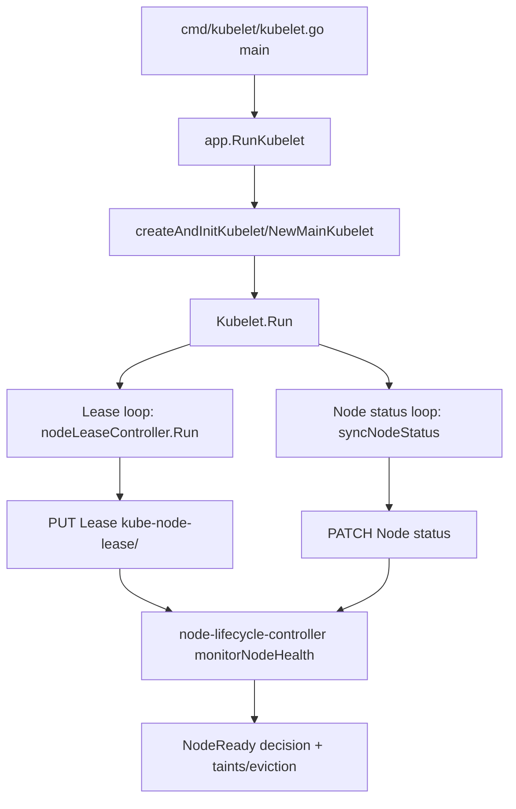

# Scenario 8: Node Heartbeat vs Node Status

## Big Picture
A node is considered healthy in Kubernetes by combining two signals produced by kubelet: a lightweight `Lease` heartbeat and a heavier `Node.status` update. These are related but not the same path. Kubelet starts both loops, and the node lifecycle controller in kube-controller-manager consumes both signals to decide when to mark a node `Ready`, `NotReady`, or `Unknown`.



## Reading Guide (Beginner)
- Trigger: kubelet process starts and enters `Kubelet.Run()`.
- First durable state change: first successful write to either `Lease` (`kube-node-lease/<node>`) or `Node.status`.
- Success criterion: lease `renewTime` keeps moving forward, and node remains `Ready` unless health really degrades.
- Most common confusion: `Node.status` is not a sub-field of `Lease`; they are different API objects and different update loops.

## Interface Resolution Guide (This Scenario)
This flow crosses several interfaces. Use this sequence at each boundary: interface type -> concrete struct -> factory/constructor -> field wiring -> runtime call site.

1. `lease.Controller` -> `*controller`
- Interface: `type Controller interface` in `staging/src/k8s.io/component-helpers/apimachinery/lease/controller.go:50`
- Concrete: `type controller struct` in `staging/src/k8s.io/component-helpers/apimachinery/lease/controller.go:59`
- Factory: `NewController(...) Controller` in `staging/src/k8s.io/component-helpers/apimachinery/lease/controller.go:83`
- Wiring: `klet.nodeLeaseController = lease.NewController(...)` in `pkg/kubelet/kubelet.go:1148`
- Runtime: `go kl.nodeLeaseController.Run(...)` in `pkg/kubelet/kubelet.go:1951`

2. `coordinationv1.LeaseInterface` -> `*leases` (generated typed client)
- Interface: `type LeaseInterface interface` in `staging/src/k8s.io/client-go/kubernetes/typed/coordination/v1/lease.go:40`
- Concrete: `type leases struct` in `staging/src/k8s.io/client-go/kubernetes/typed/coordination/v1/lease.go:54`
- Factory: `CoordinationV1Client.Leases(namespace)` in `staging/src/k8s.io/client-go/kubernetes/typed/coordination/v1/coordination_client.go:39`, returning `newLeases(...)`
- Runtime use: `leaseClient.Update(...)` in `staging/src/k8s.io/component-helpers/apimachinery/lease/controller.go:246`

3. `clientset.Interface` -> `*kubernetes.Clientset`
- Interface: `type Interface interface` in `staging/src/k8s.io/client-go/kubernetes/clientset.go:83`
- Concrete: `type Clientset struct` in `staging/src/k8s.io/client-go/kubernetes/clientset.go:141`
- Factory: `clientset.NewForConfig(...)` in `staging/src/k8s.io/client-go/kubernetes/clientset.go:476`
- Wiring: kubelet heartbeat client is built in `cmd/kubelet/app/server.go:719` and stored in `kubeDeps.HeartbeatClient`

## End-to-End Flow
1 -> 2 -> 3 -> 4 -> 5 -> 6

1. Kubelet binary entry and bootstrap
2. Kubelet wires two independent node-health loops
3. Lease heartbeat loop renews `Lease` frequently
4. Node status loop patches `Node.status` less frequently (or on change)
5. Node lifecycle controller watches both signals
6. Controller marks `NodeReady`/taints based on freshness window

## Step-by-Step Code Trace

### [1] True Entry Point: kubelet `main()` to `Kubelet.Run()`
Concept primer: This is where the process starts. We first need the real entry before discussing heartbeat details.

Primary source:
- `cmd/kubelet/kubelet.go:35` (`main`)
- `cmd/kubelet/app/server.go:1240` (`RunKubelet`)
- `cmd/kubelet/app/server.go:1296` (`startKubelet`)

```go
// cmd/kubelet/kubelet.go:35
func main() {
    command := app.NewKubeletCommand(context.Background())
    code := cli.Run(command)
    os.Exit(code)
}

// cmd/kubelet/app/server.go:1298
go k.Run(ctx, podCfg.Updates())
```

Related code:
- `cmd/kubelet/app/server.go:1312` (`createAndInitKubelet` -> `kubelet.NewMainKubelet`)

### [2] Kubelet creates both health loops (Lease and Node status)
Concept primer: kubelet deliberately separates "light heartbeat" and "full node status" to reduce control-plane load. Lease is cheap and frequent; Node status is richer and less frequent.

Primary source:
- `pkg/kubelet/kubelet.go:1147` to `pkg/kubelet/kubelet.go:1148`
- `pkg/kubelet/kubelet.go:1941`
- `pkg/kubelet/kubelet.go:1951`

```go
// lease wiring
renewInterval := time.Duration(float64(leaseDuration) * nodeLeaseRenewIntervalFraction)
klet.nodeLeaseController = lease.NewController(...)

// node status periodic loop
wait.JitterUntil(func() { kl.syncNodeStatus(ctx) }, kl.nodeStatusUpdateFrequency, 0.04, true, wait.NeverStop)

// lease renewal loop
go kl.nodeLeaseController.Run(context.Background())
```

Argument decoding:
- `nodeLeaseRenewIntervalFraction` (`pkg/kubelet/kubelet.go:239`) = `0.25`, so default lease renew interval is `40s * 0.25 = 10s`.
- `jitterFactor` in status loop is `0.04`.
- From `wait.Jitter` docs (`staging/src/k8s.io/apimachinery/pkg/util/wait/wait.go:92`), jittered delay is in `[period, period + 0.04*period]`.

> ⚠️ Interface hop inline:
> `lease.Controller` is interface-typed in kubelet (`pkg/kubelet/kubelet.go:1463`) but the runtime object is `*controller` returned by `lease.NewController` (`staging/src/k8s.io/component-helpers/apimachinery/lease/controller.go:83`).

Related code:
- `staging/src/k8s.io/kubelet/config/v1beta1/types.go:330` (`NodeStatusUpdateFrequency`)
- `staging/src/k8s.io/kubelet/config/v1beta1/types.go:338` (`NodeStatusReportFrequency`)
- `staging/src/k8s.io/kubelet/config/v1beta1/types.go:348` (`NodeLeaseDurationSeconds`)

### [3] Lease loop internals: create/ensure/renew
Concept primer: The lease controller keeps a small object fresh. It first ensures the Lease exists, then repeatedly updates `spec.renewTime`.

Primary source:
- `staging/src/k8s.io/component-helpers/apimachinery/lease/controller.go:143` (`Run`)
- `staging/src/k8s.io/component-helpers/apimachinery/lease/controller.go:151` (`sync`)
- `staging/src/k8s.io/component-helpers/apimachinery/lease/controller.go:214` (`ensureLease`)
- `staging/src/k8s.io/component-helpers/apimachinery/lease/controller.go:240` (`retryUpdateLease`)
- `staging/src/k8s.io/component-helpers/apimachinery/lease/controller.go:269` (`newLease`)

```go
// Run loop
wait.JitterUntilWithContext(ctx, c.sync, c.renewInterval, 0.04, true)

// Desired fields on each write
lease.Spec.HolderIdentity = ptr.To(c.holderIdentity)
lease.Spec.LeaseDurationSeconds = ptr.To(c.leaseDurationSeconds)
lease.Spec.RenewTime = &metav1.MicroTime{Time: c.clock.Now()}
```

Term definitions in this codebase:
- `HolderIdentity`: who is claiming the lease (`nodeName` for node heartbeat).
- `LeaseDurationSeconds`: freshness window observers use before considering heartbeat stale.
- `RenewTime`: latest heartbeat timestamp.

> ⚠️ Interface hop inline:
> `controller` stores `leaseClient coordclientset.LeaseInterface` (`staging/src/k8s.io/component-helpers/apimachinery/lease/controller.go:61`).
> Resolution path is: `LeaseInterface` (`.../typed/coordination/v1/lease.go:40`) -> concrete `leases` (`.../lease.go:54`) -> selected by `CoordinationV1Client.Leases(namespace)` (`.../coordination_client.go:39`) -> used at runtime by `leaseClient.Update`.

### [4] Node status loop internals: compute, compare, patch
Concept primer: Node status carries detailed information (conditions, capacity, addresses, images, etc.). Because it is larger and more expensive, kubelet patches it only when changed or when report period expires.

Primary source:
- `pkg/kubelet/kubelet_node_status.go:452` (`syncNodeStatus`)
- `pkg/kubelet/kubelet_node_status.go:471` (`updateNodeStatus`)
- `pkg/kubelet/kubelet_node_status.go:489` (`tryUpdateNodeStatus`)
- `pkg/kubelet/kubelet_node_status.go:540` (`isUpdateStatusPeriodExpired`)
- `pkg/kubelet/kubelet_node_status.go:593` (`patchNodeStatus`)
- `pkg/kubelet/kubelet_node_status.go:753` (`nodeStatusHasChanged`)

```go
node, changed := kl.updateNode(ctx, originalNode)
shouldPatchNodeStatus := changed || kl.isUpdateStatusPeriodExpired()

if !shouldPatchNodeStatus {
    kl.markVolumesFromNode(node)
    return nil
}

updatedNode, err := kl.patchNodeStatus(originalNode, node)
```

What this solves:
- Avoids excessive `Node` writes on every heartbeat tick.
- Still guarantees eventual full status refresh (`nodeStatusReportFrequency`) even without major changes.

Related code:
- `pkg/kubelet/kubelet_node_status.go:550` (`updateNode`)
- `pkg/kubelet/kubelet_node_status.go:664` (`defaultNodeStatusFuncs`)

### [5] Control plane consumer: node lifecycle controller uses both signals
Concept primer: kubelet writes; node lifecycle controller decides health. It tracks both `NodeReady` condition heartbeat and Lease renewals.

Primary source:
- `cmd/kube-controller-manager/app/core.go:172` (`newNodeLifecycleController`)
- `cmd/kube-controller-manager/app/core.go:178` (passes Lease informer)
- `pkg/controller/nodelifecycle/node_lifecycle_controller.go:316` (`NewNodeLifecycleController`)
- `pkg/controller/nodelifecycle/node_lifecycle_controller.go:678` (`monitorNodeHealth`)
- `pkg/controller/nodelifecycle/node_lifecycle_controller.go:956` (reads lease)

```go
// consume lease updates from informer/lister
observedLease, _ := nc.leaseLister.Leases(v1.NamespaceNodeLease).Get(node.Name)
if observedLease != nil && (savedLease == nil || savedLease.Spec.RenewTime.Before(observedLease.Spec.RenewTime)) {
    nodeHealth.lease = observedLease
    nodeHealth.probeTimestamp = nc.now()
}
```

Why both are used:
- Lease gives a frequent liveness pulse.
- Node status gives richer condition data and transition details.
- Controller uses freshness (`probeTimestamp + gracePeriod`) to decide when to degrade health.

> ⚠️ Interface hop inline:
> `leaseLister coordlisters.LeaseLister` (`pkg/controller/nodelifecycle/node_lifecycle_controller.go:255`) is backed by informer wiring in constructor (`leaseInformer.Lister()` at `.../node_lifecycle_controller.go:426`). Runtime selection comes from kube-controller-manager wiring (`InformerFactory.Coordination().V1().Leases()` at `cmd/kube-controller-manager/app/core.go:180`).

### [6] Degraded path: if both signals are stale, controller sets `Unknown`
Concept primer: this is the failure semantics. If no fresh lease/status heartbeat arrives within grace period, node lifecycle controller updates conditions to `Unknown` and triggers taint-based reactions.

Primary source:
- `pkg/controller/nodelifecycle/node_lifecycle_controller.go:992` (staleness branch)
- `pkg/controller/nodelifecycle/node_lifecycle_controller.go:996` (condition list)
- `pkg/controller/nodelifecycle/node_lifecycle_controller.go:1021` (`UpdateStatus`)
- `pkg/controller/nodelifecycle/node_lifecycle_controller.go:798` (`processTaintBaseEviction`)

```go
if nc.now().After(nodeHealth.probeTimestamp.Add(gracePeriod)) {
    // mark NodeReady/pressure conditions Unknown and update Node status
    if _, err := nc.kubeClient.CoreV1().Nodes().UpdateStatus(ctx, node, metav1.UpdateOptions{}); err != nil {
        return gracePeriod, observedReadyCondition, currentReadyCondition, err
    }
}
```

Related code:
- `pkg/controller/nodelifecycle/node_lifecycle_controller.go:279` (explicitly documents two health signals: NodeStatus and NodeLease)

## Related Code Map

| Step | Primary file | Key symbol(s) | Line(s) |
|---|---|---|---|
| 1 | `cmd/kubelet/kubelet.go` | `main` | 35 |
| 1 | `cmd/kubelet/app/server.go` | `RunKubelet`, `startKubelet` | 1240, 1296 |
| 2 | `pkg/kubelet/kubelet.go` | `lease.NewController`, `syncNodeStatus`, `nodeLeaseController.Run` | 1148, 1941, 1951 |
| 3 | `staging/src/k8s.io/component-helpers/apimachinery/lease/controller.go` | `Run`, `sync`, `ensureLease`, `retryUpdateLease`, `newLease` | 143, 151, 214, 240, 269 |
| 4 | `pkg/kubelet/kubelet_node_status.go` | `syncNodeStatus`, `tryUpdateNodeStatus`, `patchNodeStatus` | 452, 489, 593 |
| 5 | `cmd/kube-controller-manager/app/core.go` | `newNodeLifecycleController` | 172 |
| 5-6 | `pkg/controller/nodelifecycle/node_lifecycle_controller.go` | `monitorNodeHealth`, `tryUpdateNodeHealth` | 678, 850 |
| API | `staging/src/k8s.io/api/coordination/v1/types.go` | `LeaseSpec` | 53 |

## Verify It Yourself

```bash
# 1) Watch lease renewals for one node
kubectl get lease -n kube-node-lease <node-name> -w

# 2) Compare node ready heartbeat timestamp over time
kubectl get node <node-name> -o jsonpath='{.status.conditions[?(@.type=="Ready")].lastHeartbeatTime}{"\n"}'

# 3) Show kubelet-config timing knobs (if exposed)
kubectl -n kube-system get cm kubelet-config -o yaml | egrep 'nodeStatusUpdateFrequency|nodeStatusReportFrequency|nodeLeaseDurationSeconds'

# 4) Observe controller-manager decisions
kubectl -n kube-system logs -l component=kube-controller-manager --tail=200 | egrep 'monitorNodeHealth|NodeNotReady|NodeStatusUnknown'

# 5) Confirm Lease object fields directly
kubectl get lease -n kube-node-lease <node-name> -o jsonpath='{.spec.holderIdentity}{" "}{.spec.leaseDurationSeconds}{" "}{.spec.renewTime}{"\n"}'
```

## Gotchas

> ⚠️ `every ~10s with 4% jitter` does not mean exactly every 10.000s. In this code path, jitter is additive from `period` up to `period + 4%` (`wait.Jitter`), so renew spacing is intentionally slightly randomized.

> ⚠️ A fresh Lease can keep a node considered healthy even when full `Node.status` updates are sparse. This is by design to reduce API load.

> ⚠️ `context.Background()` is intentionally used for lease renewal in kubelet (`pkg/kubelet/kubelet.go:1951`) so renewals can continue during graceful shutdown windows.

## Related Scenarios
- [04-kubelet-pod-lifecycle.md](04-kubelet-pod-lifecycle.md)
- [07-leases-heartbeat-leader-election.md](07-leases-heartbeat-leader-election.md)
